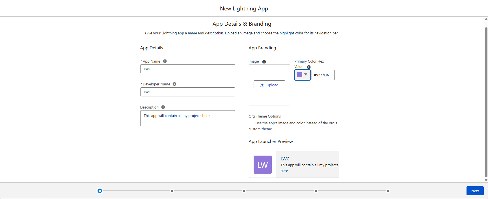
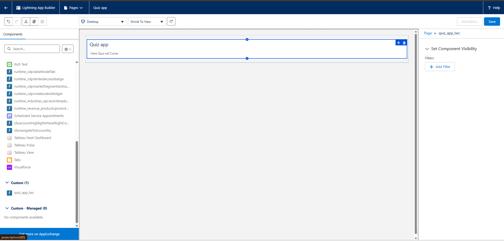
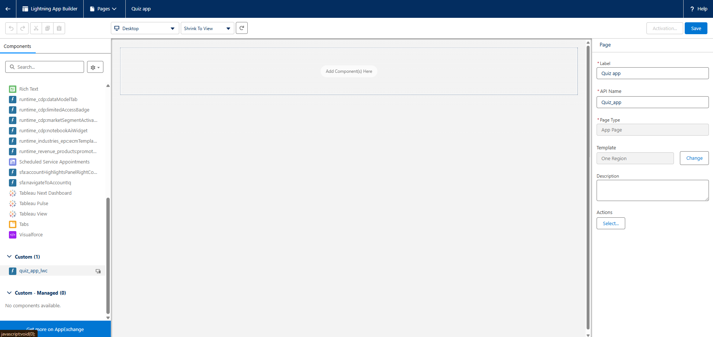
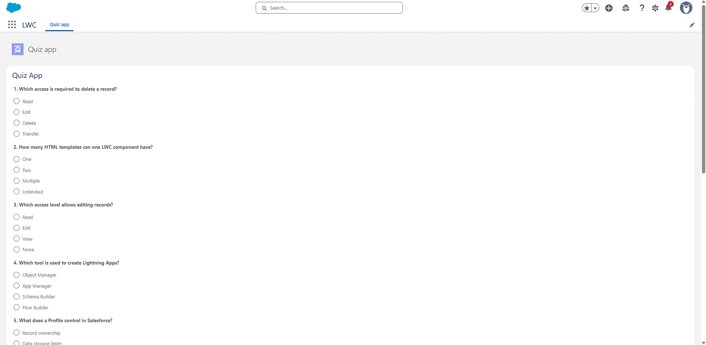
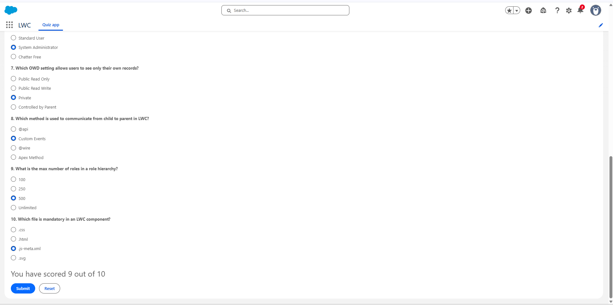

# lwc-quiz-app

A simple, interactive **Quiz Application** built using **Salesforce Lightning Web Components (LWC)**.
It randomly displays **10 questions out of a pool of ~50 questions**, lets users submit answers, shows the score, and allows reset with a fresh set of questions.

---

## ✨ Features

* Built using **pure LWC (no Apex)**
* Around **50 Salesforce + LWC questions**
* Random selection of questions on every load
* Submit button enabled only when all questions are answered
* Score shown only after submission
* Reset button clears answers and reloads new questions
* Uses SLDS for clean UI

---

## 📸 Screenshots

### App creation (App Manager)



### Lightning Page setup




### Initial UI when app opens



### Score after submitting the quiz



---

## 📂 Project Structure

```
lwc-quiz-app/
└── Quiz_app/
    └── force-app/
        └── main/
            └── default/
                └── lwc/
                    └── quiz_app_lwc/
                        ├── quiz_app_lwc.html
                        ├── quiz_app_lwc.js
                        └── quiz_app_lwc.js-meta.xml
```

---

## 🧠 Concepts Used (Explained Simply)

### 1. State-driven UI (Core LWC concept)

* The UI reacts to JavaScript state
* Radio selections update `selectedAnswers`
* Button enable/disable and score visibility are derived from state

```js
selectedAnswers = {};
showScore = false;
```

If the UI looks wrong, state is wrong. No DOM hacks.

---

### 2. `for:each` for rendering questions

Used to loop through questions dynamically:

```html
<template for:each={questionsWithNumber} for:item="quiz">
```

Each question gets a stable `key` using `quiz.id`.

---

### 3. Controlled radio inputs

* Each question uses the same `name` for its options
* Ensures only one option can be selected per question

```html
<input type="radio" name={quiz.id} value="a" onchange={changeHandler} />
```

---

### 4. Immutable state updates

Instead of mutating objects, state is replaced:

```js
this.selectedAnswers = {
  ...this.selectedAnswers,
  [name]: value
};
```

This guarantees reactivity.

---

### 5. Computed properties (`get`)

Used to derive values instead of storing them:

```js
get allNotSelected() {
  return Object.keys(this.selectedAnswers).length < this.quizQuestions.length;
}
```

This keeps logic clean and predictable.

---

### 6. Conditional rendering (`if:true`)

Score is shown **only after submit**:

```html
<template if:true={showScore}>
```

No manual show/hide logic.

---

### 7. Lifecycle hook: `connectedCallback`

Used to load random questions when component loads:

```js
connectedCallback() {
  this.quizQuestions = this.getRandomQuestions(10);
}
```

---

### 8. Reset pattern (important)

Reset clears:

* state
* score
* UI (radio buttons)

```js
this.template.querySelector('form').reset();
```

This avoids stale browser input state.

---

## 🚀 Setup & Deployment Steps

### 1️⃣ Create a Lightning App

* Go to **Setup → App Manager**
* Click **New Lightning App**
* Fill details as shown in `app_manager.png`
* Keep defaults and click **Save & Finish**

---

### 2️⃣ Create a Lightning App Page

* Go to **Setup → Lightning App Builder**
* Click **New → App Page**
* Give it a name
* Choose **One Region** template
* Save

---

### 3️⃣ Create LWC in VS Code

```bash
sf org login web
sf config set target-org=<your-username>
```

Create the component and add the HTML & JS code.

---

### 4️⃣ Deploy to Salesforce

```bash
sf project deploy start
```

---

### 5️⃣ Add Component to Page

* Open your Lightning App Page
* Drag **quiz_app_lwc** onto the page
* Click **Save** and **Activate**

---


## 🔗 Source Code

* Repo:
  [https://github.com/officialayushyadav15/lwc-quiz-app](https://github.com/officialayushyadav15/lwc-quiz-app)

* Component code:
  [https://github.com/officialayushyadav15/lwc-quiz-app/tree/main/Quiz_app/force-app/main/default/lwc/quiz_app_lwc](https://github.com/officialayushyadav15/lwc-quiz-app/tree/main/Quiz_app/force-app/main/default/lwc/quiz_app_lwc)

---

## 🎥 Demo Video


https://github.com/user-attachments/assets/8a4413ea-0021-4b80-8595-0ff1d661d2d6


---

## 🙋‍♂️ About Me


I’m **Ayush Yadav**, a versatile developer building clean, practical, and impactful solutions across web development, Python, and Salesforce projects.


### Let’s connect

* 📧 Email: [officialayushyadav15@gmail.com](mailto:officialayushyadav15@gmail.com)
* 💼 GitHub: [https://github.com/officialayushyadav15](https://github.com/officialayushyadav15)
* 🔗 LinkedIn: [https://www.linkedin.com/in/ayush-yadav-408924230/](https://www.linkedin.com/in/ayush-yadav-408924230/)

---

## 🤝 Contributions

Feel free to open issues or submit pull requests. Improvements and enhancements are always welcome.

---

### 🎬 Happy Learning & Keep Building 🚀
